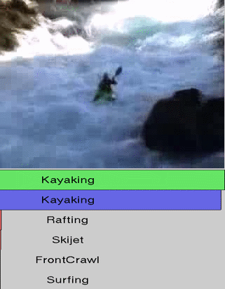

# About

This repo contains Keras implementation for C3D network based on paper ["Learning Spatiotemporal Features with 3D Convolutional Networks", Tran et al.](https://arxiv.org/abs/1412.0767) and it includes video processing pipelines coded using amazing [mPyPl package](https://pypi.org/project/mPyPl/). Model is being benchmarked on [UCF101](https://arxiv.org/abs/1212.0402) - a popular action recognition dataset - and achieves results similar to those reported by original authors.

### Examples of action recognition tasks from UCF101:
ApplyEyeMakeUp             |  Kayaking                 |  PlayingFlute
:-------------------------:|:-------------------------:|:-------------------------:
         |      | 

The whole beauty of C3D is that it's using Conv3D layers to learn spatiotemporal features from video frames and if trained on big enough amount of data it can be successfully used as a compact and uniform video feature extractor/descriptor. Features extracted from such model can easily be used to build a simple Linear SVM classifier. This approach achieves close-to-the-best results for most of the action recognition benchmark datasets while remaining very fast and efficient which is perfect for video processing tasks. C3D pretrained weights used in this exepriment are coming from training on Sports-1M dataset.

<br>

# Prerequisites

This project heavily relies on [mPyPl package](https://pypi.org/project/mPyPl/) and it's included in `requirements.txt` so in order to install it with all the other required dependencies you can run:
```
pip install -r requirements.txt
```

<br>

# How to run it

### **End-to-end experiment**

In order to run the experiment end-to-end (from original UCF101 videos, through preprocessing and features generation) you need to follow the steps below:

1. [Download UCF101 dataset](https://www.crcv.ucf.edu/data/UCF101/UCF101.rar) and put videos with all classes subfolders under `data/ucf101/videos/` so you have a structure such as this:

    ```
    data
    ├── ucf101
        ├── videos
            ├── ApplyEyeMakeup    
            │   ├── v_ApplyEyeMakeup_g01_c01.avi       
            │   ├── v_ApplyEyeMakeup_g01_c02.avi           
            │   └── ...  
            ├── ApplyLipstick             
            │   ├── v_ApplyLipstick_g01_c01.avi       
            │   ├── v_ApplyLipstick_g01_c02.avi            
            │   └── ...                
            └── ...
    ```

2. Download [Sports-1M pretrained C3D model](https://privdatastorage.blob.core.windows.net/github/video-action-recognition/weights_C3D_sports1M_tf.h5) and put it under `models/`

3. Go to the [notebook with end-to-end experiment](notebooks/kz-ucf101-action-recognition-with-c3d-svm.ipynb) for action recognition using pretrained C3D on UCF101 and execute it cell by cell

<br>

### **Final classification part of experiment only**

In case you don't want to go through all the data loading and preprocessing steps (as it is very time and storage consuming) you can simply download feature vectors for each video and skip the data loading and preprocessing steps from end-to-end experiment:

1. [Download feature vectors](https://privdatastorage.blob.core.windows.net/github/video-action-recognition/videos.zip) for each video from UCF101 and put it under `data/ucf101/videos/` so you have a structure such as this:

    ```
    data
    ├── ucf101
        ├── videos
            ├── ApplyEyeMakeup    
            │   ├── v_ApplyEyeMakeup_g01_c01.proc.c3d-avg.npy     
            │   ├── v_ApplyEyeMakeup_g01_c02.proc.c3d-avg.npy            
            │   └── ...  
            ├── ApplyLipstick             
            │   ├── v_ApplyLipstick_g01_c01.proc.c3d-avg.npy        
            │   ├── v_ApplyLipstick_g01_c02.proc.c3d-avg.npy              
            │   └── ...                
            └── ...
    ```

2. Go to the [notebook with end-to-end experiment](notebooks/kz-ucf101-action-recognition-with-c3d-svm.ipynb) for action recognition using pretrained C3D on UCF101 and execute it cell by cell **skipping STEP 1 and STEP 2**

